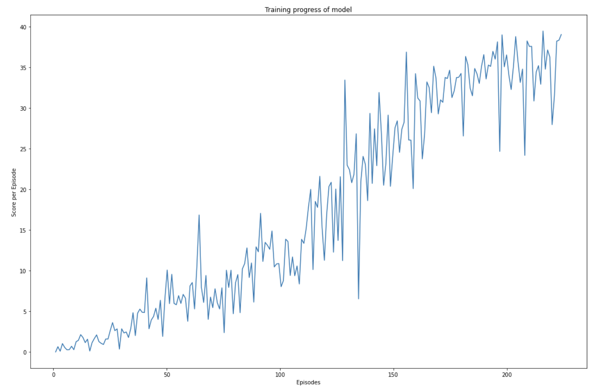
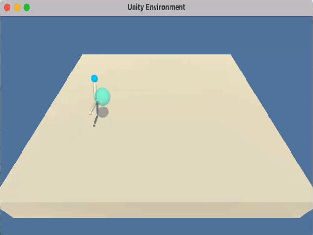

# Udacity RL course: Project 2 - Report

## Learning algorithm
The training algorithm is roughly structure as follows:
- The environment is initialized and the initial state is obtained
- The state is passed to the agent, which returns an action
- This action is passed to the environment, which will respond with a new state, a reward and a flag indicating if the episode is finished or not
- This tuple (new state, reward, done) is passed to the agent so it can update it's learning process.
- The learning process uses the Deep Deterministic Policy Gradient (DDPG), an algorithm which concurrently learns a Q-function and a policy.
- The new state is passed to the agent, restarting the loop.

The actor and critic are modeled using a Neural Network with 3 hidden dense layers and 2 Batch Normalization layers. 

The parameters used in the DDPG algorithm are as follows:
```
BUFFER_SIZE = int(1e6)  # replay buffer size
BATCH_SIZE = 128  # minibatch size
GAMMA = 0.99  # discount factor
TAU = 0.001  # for soft update of target parameters
LR_ACTOR = 0.0002  # learning rate of the actor
LR_CRITIC = 0.0002  # learning rate of the critic
WEIGHT_DECAY = 0.00001  # L2 weight decay
```
The parameters were either kept constant (taken from the example project [DDPG Bipedal](https://github.com/udacity/deep-reinforcement-learning/tree/master/ddpg-bipedal)) or fine tuned via trial and error.

## Results
The agent is capable to achieve an average score of >30 after approximatly 200 episodes.

```
# Run the training loop (this will take a while)
scores = ddpg(n_episodes=500, print_every=100, stop_score=30)

Episode 100	Average Score: 5.50
Episode 200	Average Score: 29.34
Episode 204	Average Score: 30.24
Environment solved in 204 episodes!	Average Score: 30.24

```



Visual inspection of the agent behavior in the environment confirms that it acts as expected


## Future work
- Optimizing hyperparameters.
- Testing different Neural Network architectures.
- Repeating the learning process with the Reacher_20 environment (parallel learning)
- Testing different algorithms such as PPO, A3C, and D4PG
